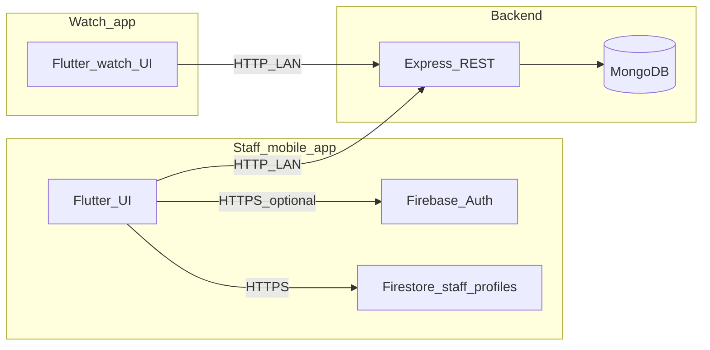

# ElderLink — Viva / Project Defense Document

This document describes the **current** ElderLink system: what it is, how parts talk to each other, how login works, how the mobile app and watch connect to the server, and how major screens use the backend. Use it to answer oral examination questions.

---

## 1. What is ElderLink?

**ElderLink** is a **health and safety platform** for elderly users and caregivers. It has three main parts:

| Part | Technology | Role |
|------|------------|------|
| **Staff mobile app** | Flutter (Dart), Android/iOS | Caregivers/nurses: dashboard, elders, medicines, alerts, music panel, settings; **Firebase Authentication** for staff identity; **Firestore** for staff profile documents. |
| **Elder watch app** | Flutter (Dart), watch / compact UI | Elder: panic, medicines, vitals, music, “My Info”; talks to the **same Node backend** over HTTP; **no Firebase** on the watch flow described here. |
| **Backend API** | Node.js, Express, MongoDB | Single source of truth for readings, elders, medicines, alerts, music sessions; **REST JSON** over HTTP. |
| **Google Firebase** | Firebase Auth + Cloud Firestore | **Staff only**: sign-in (email/password, Google), password reset; profiles in `staff_profiles/{uid}`. |

**Admin mode** on the mobile app is a **separate, local “dummy” login** (not Firebase): credentials are checked in-app and a flag is stored in `SharedPreferences` (`admin_logged_in`).

---

## 2. High-level architecture

- **Staff app → Firebase**: Internet; used for **who is logged in** and **profile fields** (name, phone, avatar preset, etc.).
- **Staff app → Backend**: Usually **same Wi‑Fi as the PC** running Node; base URL is `http://<host>:<port>` (default host often the Windows hotspot gateway `192.168.137.1`, port `5000`), configurable in **Settings → Backend server**.
- **Watch → Backend**: Same idea: `http://<PC_IP>:5000` (watch has its own saved host/port in preferences / dart-define).

MongoDB holds **clinical and operational data** (elders, readings, medicines, sessions). Firestore holds **staff profile metadata** keyed by Firebase UID—not a duplicate of Mongo for those domains.

---

## 3. How communication works (detailed)

### 3.1 REST API (Node + Express)

- Server listens on **`0.0.0.0`** and port from **`PORT`** env (default **5000**).
- **CORS** is open with `origin: true` so phone/watch browsers or HTTP clients on the LAN can call the API.
- JSON body parsing via `express.json()`.

**Mounted routes** (from `backend/index.js`):

| Prefix | Purpose |
|--------|---------|
| `GET /health` | Plain “ok” liveness. |
| `GET /api/backend-info` | JSON probe: confirms process is ElderLink (`service: elderlink`). |
| `GET/POST /api/purge-elder` (+ aliases) | Delete an elder and related data (staff app uses this from diagnostics/settings flows). |
| `/api/readings` | Vitals / reading documents. |
| `/api/elders` | Elder CRUD, sync from watch. |
| `/api/medicines` | Medicine assignments and status. |
| `/api/heart-alert` | Heart / BP alert events. |
| `/api/music` | Music catalog / dashboard-style data. |
| `/api/music-sessions` | Playback session metadata (watch can report sessions). |

The backend also runs a **periodic job** to close stale music sessions (`musicController.runMusicStaleCleanup`).

### 3.2 Mobile `ApiService` (`mobile/lib/services/api_service.dart`)

- Builds URLs as `http://{apiHost}:{apiPort}/api/...`.
- **Host/port** come from `SharedPreferences` keys `mobile_api_host` / `mobile_api_port`, or compile-time `MOBILE_API_HOST` / `MOBILE_API_PORT`, with sensible defaults for LAN.
- Important operations include: `getAllReadings`, `getAllElders`, `addElder`, `deleteElder`, `purgeElderAllData`, `getMedicines`, `addMedicine`, `updateMedicineStatus`, `getMusicDashboard`, panic/health/heart helpers where implemented, and backend probe helpers (`probeElderLinkBackend`, etc.).

### 3.3 Watch `ApiService` (`watch/lib/services/api_service.dart`)

- Separate class, same conceptual pattern: `watch_api_host` / `watch_api_port` in prefs, defaults `WATCH_API_HOST` / `WATCH_API_PORT` (often `192.168.137.1:5000`).
- Watch loads saved **elder identity** (name, room, age, gender, etc.), **syncs elder profile** to server (`syncElderProfileToServer` / related), posts readings, panic, medicines taken, music session metadata, etc.

### 3.4 Firebase (staff mobile only)

- **`firebase_core`** + **`firebase_auth`**: session persistence, email/password, Google Sign-In, password reset.
- **`cloud_firestore`**: document `staff_profiles/{uid}` with fields like `displayName`, `email`, `avatarPreset` (`neutral` / `custom` / legacy values), `phone`, timestamps.
- **`flutter_riverpod`**: `authStateProvider`, `staffProfileProvider`, `AuthService`, `StaffProfileRepository`.

**Firestore security rules** (see `mobile/firebase/firestore.rules`): authenticated users may **read/write only** `staff_profiles/{uid}` where `uid == request.auth.uid`.

### 3.5 Time zone (Karachi)

- Shared package **`elderlink`** (path: `watch/` package used by mobile too) provides **`karachi_time.dart`**: **Asia/Karachi** wall-time helpers.
- Used so **“taken at”** on medicines and similar UI match **local care home time**, not raw UTC confusion.

---

## 4. How login works

### 4.1 Staff (caregiver / nurse) — Firebase

1. User opens app → optional **logo splash** → **Welcome** → **Join** → **Staff** → **`FirebaseLoginScreen`**.
2. Options: **email + password**, **Google Sign-In**, link to **sign-up** and **forgot password**.
3. **Sign-up** creates Firebase user and **`StaffProfileRepository.ensureProfileFromFirebaseUser`** creates/merges Firestore `staff_profiles/{uid}`.
4. **`AuthWrapper`** (`main.dart`) watches `authStateProvider` (Firebase `authStateChanges`):
   - If `User != null` → **`StaffHomeScreen`** (bottom nav).
   - If null → login / sign-up flow.
5. **Logout**: `AuthService.signOut()` + Google sign-out where applicable; navigation reset via `staff_gate_nav.dart` / root pop.
6. **Android Google Sign-In** requires **SHA-1 and SHA-256** of the **signing keystore** registered in Firebase Console for package **`com.elderlink.mobile`**. (Current Gradle config may sign **release** with **debug** keys for convenience—both APKs then share the same fingerprints until you add a real release keystore.)

### 4.2 Admin — local dummy

- **Join** → **Admin** → **`AdminLoginScreen`**: password checked in code; on success, `SharedPreferences` sets `admin_logged_in = true`.
- **`AuthWrapper`** shows **`AdminHomeScreen`** when admin flag is set (before staff Firebase branch as implemented).
- **Admin logout**: clears pref and navigates back to join/welcome flow.

### 4.3 Watch — elder identity (not Firebase)

- Elder **name / room / age / gender** etc. are stored locally and **synced to MongoDB** via backend (e.g. elder sync endpoints) so the **staff medicines list** and server-side records stay aligned.
- Watch does **not** use Firebase staff login; it identifies the **elder** to the API (by username / profile fields as implemented in `ApiService`).

---

## 5. Staff mobile app — screens and server linkage

**Shell:** `StaffHomeScreen` uses an **`IndexedStack`** + **bottom navigation** with five tabs:

| Tab | Screen | Main backend / data usage |
|-----|--------|----------------------------|
| Dashboard | `dashboard_screen.dart` | `ApiService.getAllReadings()` (poll ~15s); charts/summary; vitals processing for local alerts (`StaffVitalAlertService`); opens **Account settings** (avatar from Firebase + Firestore + local image). |
| Elders | `elders_screen.dart` | Loads elders/readings from API; **add elder** → `addElder`; **delete/purge** flows; card tap → **bottom sheet** with elder summary; gender UI kept on elder records per product decision. |
| Medicines | `medicines_screen.dart` | `getMedicines`, `addMedicine` (supports **multiple medicines** in one dialog), `updateMedicineStatus`; **Karachi time** for “taken at” display when watch marks taken. |
| Alerts | `alerts_screen.dart` | Reads/alerts presentation from API data; resolve/mark actions as implemented. |
| Music | `music_screen.dart` | `getMusicDashboard()`; staff view of elder listening activity. |

**Settings** (`settings_screen.dart`): **Backend server** IP/port → `ApiService.saveNetworkConfig`; **Log out** → Firebase sign-out.

**Account / profile** (`account_settings_screen.dart`, `edit_profile_screen.dart`): Firebase user + Firestore profile updates; **neutral default avatar** + **custom photo** (no male/female preset buttons); password change respects Google-linked accounts.

**Admin area** (`admin/*`): separate bottom nav; **Staff / Roles / Logs** use **`loadAdminStaffSnapshot`** — **MVP shows only the Firebase staff user on this device**; full roster would need backend or broader Firestore rules.

---

## 6. Watch app — screens and server linkage

**Entry:** `watch/lib/main.dart` — loads settings, **API host/port**, elder info, **syncs elder to server**, starts **`MedicineScheduleMonitor`**, overlays **`MedicineScheduleAlarmOverlay`** for due medicines.

**Representative screens:**

| Screen | Purpose | Server / local |
|--------|---------|----------------|
| Home | Launcher tiles | Navigation only. |
| Panic | Emergency | POST panic/alert APIs via watch `ApiService`. |
| Medicine | Reminders | Fetches today’s medicines; **taken** updates backend; **monitor** can queue **multiple** reminders and show **queued count** in overlay. |
| Health monitoring | Vitals | Sends readings (BP, HR, etc.) to backend. |
| My Info | Elder demographics | Persists and **syncs** profile to backend so staff see the elder. |
| Audio / Music | Playback | Uses shared **`MusicPlayerService`** from `elderlink` package; can **report music sessions** to MongoDB when enabled. |
| Clock / Settings | UX | Settings service; API host configuration. |

Watch and mobile **do not talk to each other directly**; they **coordinate through MongoDB** via the **same REST API**.

---

## 7. Notable integrations and features

- **Medicine flow:** Staff assign medicines in Mongo via mobile API → watch loads schedule → reminders fire → **taken** POSTed → mobile shows updated status and **correct Karachi “taken at”** time.
- **Vitals / alerts:** Watch (and possibly other sources) post readings → mobile dashboard/alerts poll readings → **local notifications** can fire (`NotificationService`, `StaffVitalAlertService`) for staff attention.
- **Music:** Elder playback on watch can create **music session** documents; mobile **Music** tab aggregates via `getMusicDashboard`.
- **Panic:** Watch triggers server-side handling; staff notifications depend on implemented alert paths.
- **Local notifications:** Initialized after first frame on mobile; **permission** requested after UI visible (Android 13+).
- **Auto-lock:** Inactivity can sign staff out (`AutoLockService`) when staff session active.

---

## 8. Repository layout (helpful for viva)

- `backend/` — Express app, controllers, Mongoose models, routes.
- `mobile/` — Staff (+ admin UI) Flutter app; `lib/auth/*`, `lib/services/api_service.dart`, `lib/main.dart`, `firebase_options.dart`, `android/app/google-services.json`.
- `watch/` — Watch Flutter app + **`elderlink` package** (shared `karachi_time`, `MusicPlayerService`, etc.) consumed by mobile via `pubspec` path dependency.
- `mobile/firebase/firestore.rules` — Firestore rules for `staff_profiles`.

---

## 9. Build and deployment notes

- **Debug APK:** `flutter build apk --debug` → `mobile/build/app/outputs/flutter-apk/app-debug.apk`.
- **Release APK:** `flutter build apk --release` → `app-release.apk`.
- **Backend:** `node` / `npm` with `.env` containing **`MONGO_URI`**, **`PORT`**; must be reachable on LAN from phone/watch.
- **Firebase:** Enable **Email/Password** and **Google** sign-in; register Android app; add **SHA-1/SHA-256** for each keystore that signs APKs you install.

---

## 10. Typical viva questions — short answers

**Q: Where is data stored?**  
**A:** MongoDB for elders, readings, medicines, alerts, music sessions. Firestore for **staff profile** documents only. Firebase Auth holds **staff credentials** (no local staff password store).

**Q: How do mobile and watch stay in sync?**  
**A:** Both use the **same REST API** and MongoDB; no peer-to-peer link.

**Q: Is the backend secure on the LAN?**  
**A:** Current design targets **trusted LAN**; production would add TLS, authentication tokens per role, and stricter CORS/network policy.

**Q: Why Firebase if you have MongoDB?**  
**A:** Firebase solves **staff identity** (multi-user phones, Google/email login, password reset) and **lightweight profile** sync; MongoDB remains the **domain database** for care data the watch produces.

**Q: What changed recently in the app?**  
**A:** Examples: Firebase-only staff auth with Riverpod; neutral staff avatars; app title **ElderLink** on bars; lighter splash; deferred startup so notification permission does not block UI; Impeller disabled on Android for some devices; multi-medicine add on mobile; watch medicine **queue count**; Karachi time on medicine “taken”; elder **detail bottom sheet** on tap; removal of unused dashboard music block; admin staff list MVP tied to **current device** Firebase user.

---

*Document generated to match the codebase structure as of the last project update. If you rename this file, keep a single “source of truth” viva doc for examiners.*
